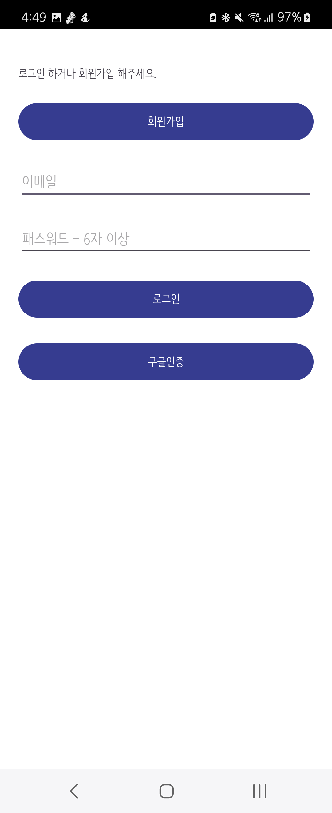
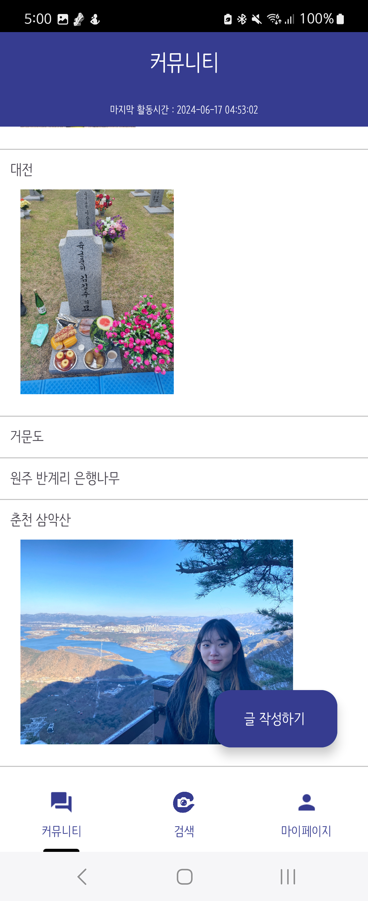
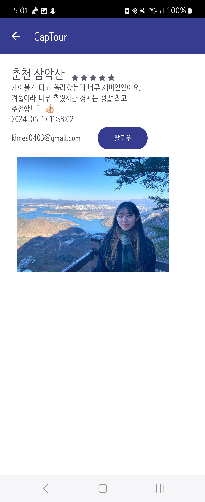
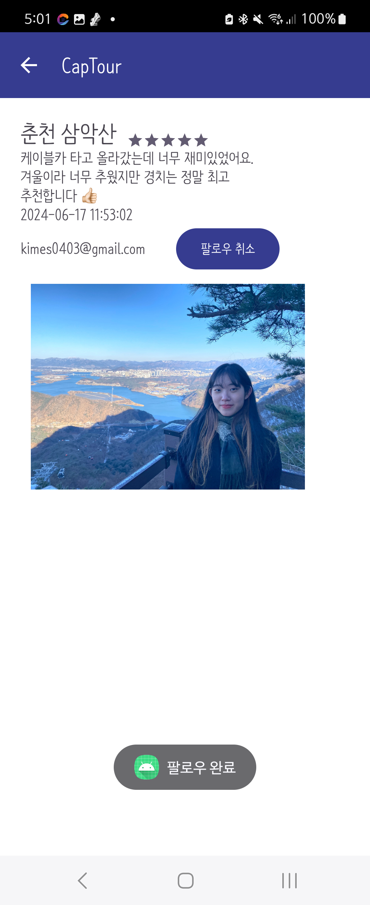
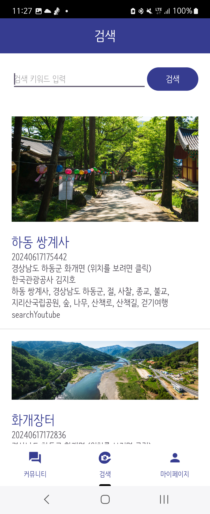
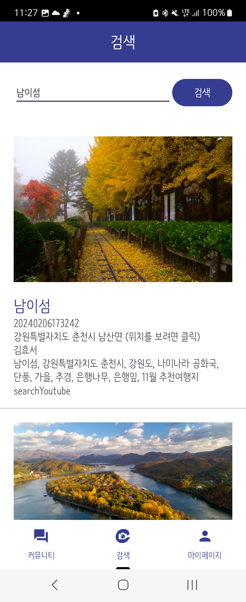
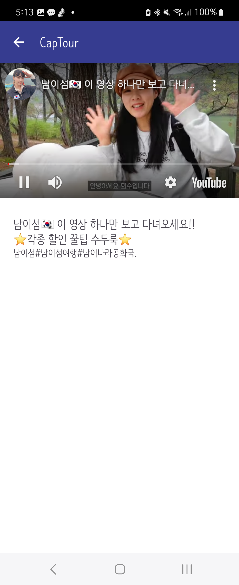
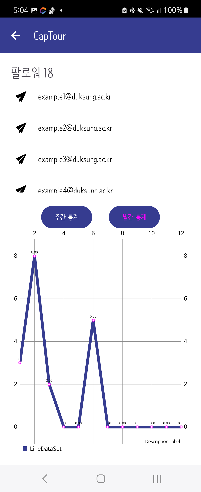
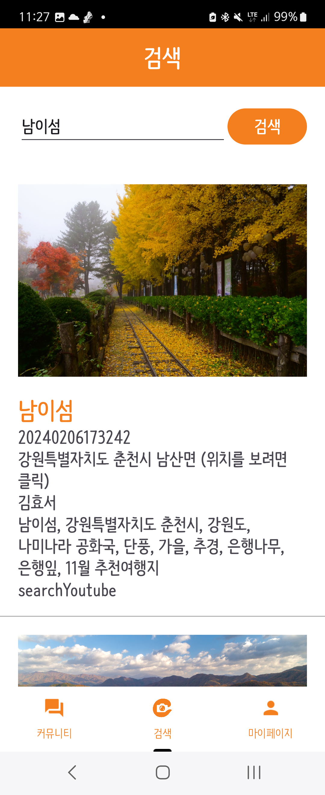

# 여행을 찍다 : CapTour

### ✔️Frond-end

### ✔️Back-end

### ✔️Database  
 

### ✔️Deploy
 

### ✔️ETC
 

## 📌 회원가입 로그인
* 마이페이지에서 로그인을 진행할 수 있습니다. 
* 로그인할 수 있는 항목은 일반 로그인(이메일 인증), 구글 로그인이 있습니다.(네이버 로그인 시 오류로 임시 주석 처리) 
* 로그인을 할 경우 로그인 이메일이 마이페이지에 뜨며, 마이페이지 항목들을 볼 수 있습니다.

  
  
  
  

## 📌 커뮤니티
* 제목, 내용, 총점, 이미지를 등록할 수 있습니다.
* 목록 중 하나를 누르면 해당 목록의 상세페이지를 볼 수 있습니다.
* 만약 내가 작성한 글이라면 팔로우/팔로우 취소 버튼이 보이지 않습니다.
* 만약 내가 작성한 글이 아니라면 팔로우 상태에 따라 팔로우/팔로우 취소 버튼이 나타납니다.
* 새로 팔로우를 할 경우 알림 메세지가 뜹니다. 

  
  
  
  
  
  

## 📌 공공 데이터 및 유튜브 검색
* 두번째 viewpager로 넘어가면 각각의 관광지들을 찍은 데이터들을 조회 및 검색할 수 있습니다.
* 위치를 클릭하면 구글 지도에서 해당 지역의 위치를 확인할 수 있습니다.
* searchYoubue를 클릭하면 해당 위치의 컨텐츠의 유튜브 영상 제목과 내용, 썸네일을 조회할 수 있습니다.
* 썸네일을 누르면 영상을 재생할 수 있습니다. 

  
  
  
  
  

## 📌 팔로워 및 팔로잉 조회
* 마이페이지에서 팔로잉 목록 조회를 누르면 내가 팔로우하는 사람들의 이메일을 볼 수 있습니다.
  * 이때 이메일을 누르면 손쉽게 메일을 보낼 수 있습니다.
  * 팔로우 취소 버튼을 이용하여 팔로우를 취소할 수 있습니다. (화면 자동 갱신)
* 마이페이지에서 팔로워 목록 조회를 누르면 나를 팔로우하는 사람들의 이메일을 볼 수 있습니다.
  * 팔로잉과 마찬가지로 메일을 보낼 수 있습니다.
  * 버튼을 눌러 주간 통계 (현재 날짜로부터 -6일), 년간 통계 (1월부터 12월)를 모두 확인할 수 있습니다.

  
  
  
  

## 📌 설정 항목 변경
* 마이페이지의 설정 항목에 들어가서 앱의 설정을 바꿀 수 있으며 설정 항목은 4개로 구성되어 있습니다.
  * 나에게 한마디를 작성할 수 있습니다.
  * 테마 색상을 주황, 보라, 파랑 중에서 설정할 수 있습니다. (앱의 메인 색상)
  * 글자 크기는 0부터 30까지 슬라이딩 바를 통해 설정할 수 있습니다.
  * 글꼴 두께는 보통(regular), 두껍게(bold) 중에 선택할 수 있습니다.

  
  
  
  
  
  

#### 💫 font
* 나눔바른펜 https://hangeul.naver.com/fonts/search?f=nanum

#### 💫 API
* Youtube https://developers.google.com/youtube/v3?hl=ko 
* 한국관광공사_관광사진 정보_GW https://www.data.go.kr/data/15101914/openapi.do
* Captour server http://13.125.163.176/swagger-ui/index.html#/

